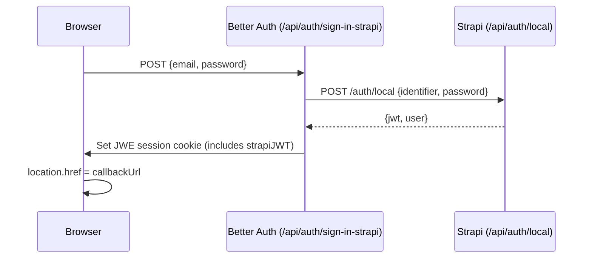
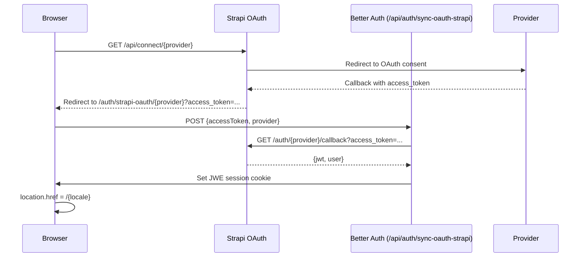
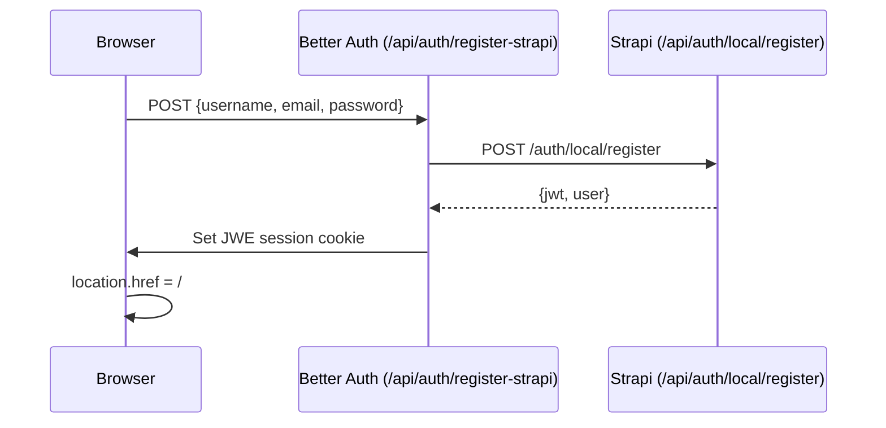
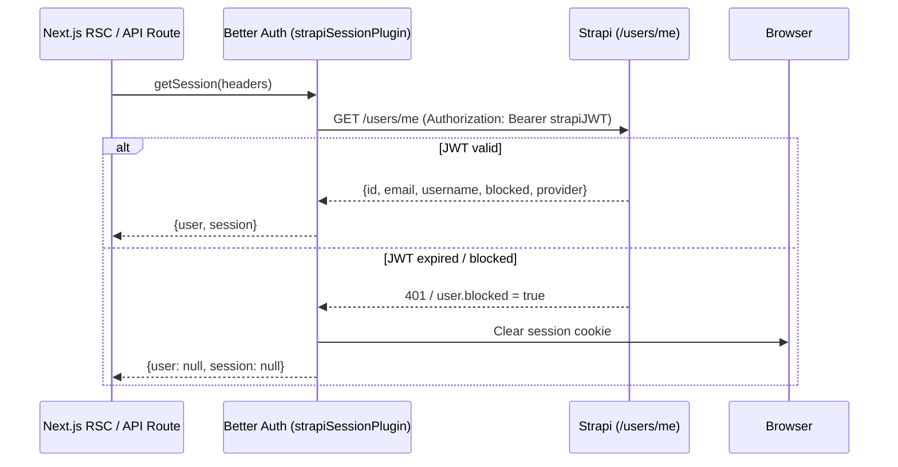
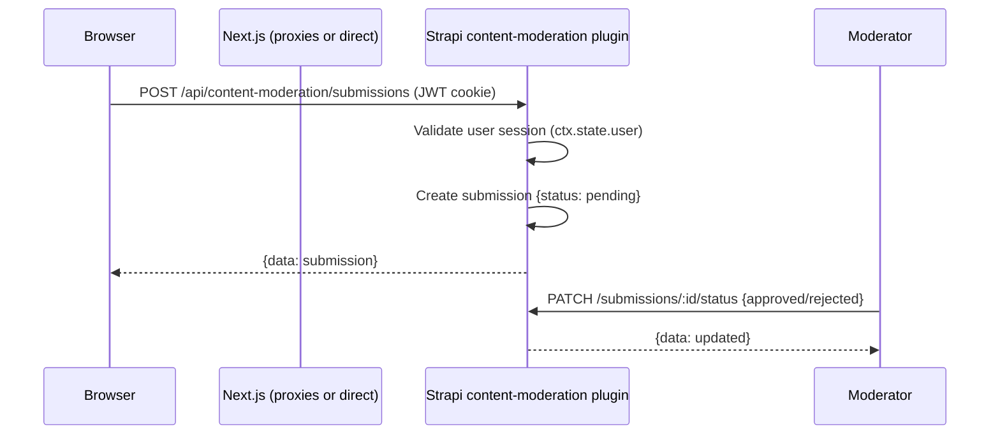
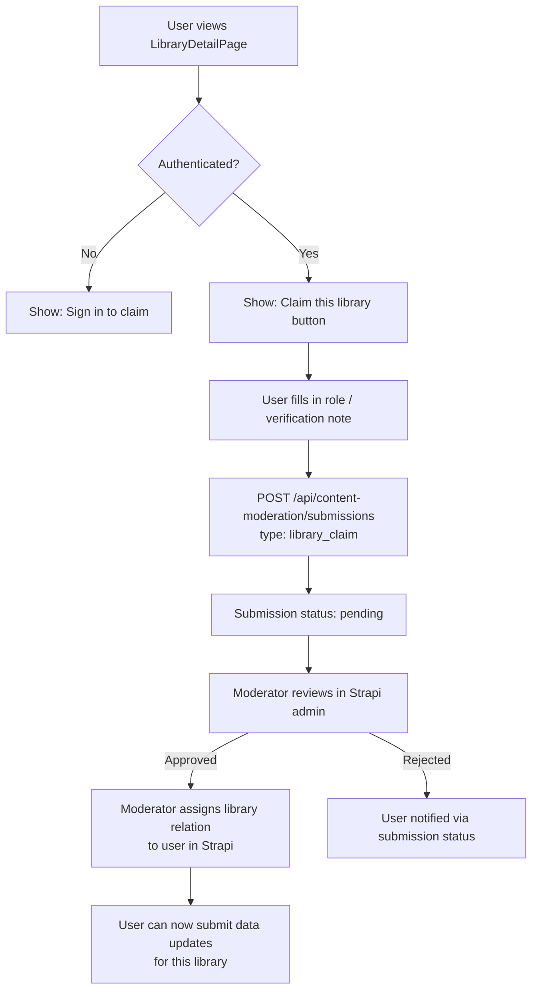

# Auth System — libraries.global

## Overview

Authentication is handled by **Better Auth** (session layer) backed by **Strapi users-permissions** (user store and OAuth). The session is stateless — a JWE-encrypted cookie that includes the Strapi JWT. Every request validates the Strapi JWT server-side.

---

## Sign-in Flow (Credentials)

## OAuth Flow (GitHub / Google)

## Registration Flow

## Session Validation on Every Request

## Submission Flow (Authenticated User)

---

## Strapi User Roles & Permissions

Strapi users-permissions plugin defines these roles. **Set these in Strapi Admin → Settings → Users & Permissions → Roles.**

### Authenticated (default logged-in role)

| Permission                       | Endpoint                                     | Notes                             |
| -------------------------------- | -------------------------------------------- | --------------------------------- |
| Read libraries                   | `GET /api/libraries`                         | browse the atlas                  |
| Read countries / regions / areas | `GET /api/countries`, etc.                   | browse hierarchy                  |
| Create submissions               | `POST /api/content-moderation/submissions`   | submit corrections, claims, edits |
| Read own submissions             | `GET /api/content-moderation/submissions/my` | view submission status            |

### Editor (moderator role — assign manually in Strapi admin)

All Authenticated permissions plus:

| Permission               | Endpoint                                               | Notes                      |
| ------------------------ | ------------------------------------------------------ | -------------------------- |
| Update submission status | `PATCH /api/content-moderation/submissions/:id/status` | approve / reject           |
| Read all submissions     | `GET /api/content-moderation/submissions` (admin)      | moderation dashboard       |
| Update library entries   | `PUT /api/libraries/:id`                               | apply approved corrections |

### Public (unauthenticated)

| Permission               | Endpoint                                               | Notes           |
| ------------------------ | ------------------------------------------------------ | --------------- |
| Read published libraries | `GET /api/libraries`                                   | atlas browsing  |
| Read published locations | `GET /api/countries`, `regions`, `areas`, `continents` |                 |
| Read map pins            | `/api/map/*`                                           | interactive map |

---

## Environment Variables

| Variable                 | Where              | Purpose                                   |
| ------------------------ | ------------------ | ----------------------------------------- |
| `BETTER_AUTH_SECRET`     | `apps/ui/.env`     | Signs the JWE session cookie              |
| `APP_PUBLIC_URL`         | `apps/ui/.env`     | Better Auth base URL                      |
| `STRAPI_URL`             | `apps/ui/.env`     | Private Strapi URL (server-side)          |
| `NEXT_PUBLIC_STRAPI_URL` | `apps/ui/.env`     | Public Strapi URL (client OAuth redirect) |
| `GITHUB_CLIENT_ID`       | `apps/strapi/.env` | GitHub OAuth app                          |
| `GITHUB_CLIENT_SECRET`   | `apps/strapi/.env` | GitHub OAuth app                          |
| `GOOGLE_CLIENT_ID`       | `apps/strapi/.env` | Google OAuth app                          |
| `GOOGLE_CLIENT_SECRET`   | `apps/strapi/.env` | Google OAuth app                          |

---

## Key Files

| File                                                     | Responsibility                         |
| -------------------------------------------------------- | -------------------------------------- |
| `apps/ui/src/lib/auth.ts`                                | Better Auth config, Strapi plugins     |
| `apps/ui/src/lib/auth-client.ts`                         | Client-side auth instance              |
| `apps/ui/src/hooks/useUserMutations.ts`                  | React Query mutations for auth actions |
| `apps/ui/src/hooks/useSubmissions.ts`                    | React Query for submission CRUD        |
| `apps/strapi/src/plugins/content-moderation/`            | Submission content type + API + admin  |
| `apps/ui/src/app/[locale]/auth/signin/`                  | Sign-in page                           |
| `apps/ui/src/app/[locale]/auth/register/`                | Register page                          |
| `apps/ui/src/app/[locale]/auth/strapi-oauth/[provider]/` | OAuth callback handler                 |

---

## Future: Adding More OAuth Providers

To add Apple or Microsoft:

1. Configure the provider in Strapi Admin → Settings → Users & Permissions → Providers
2. Add the provider's OAuth app credentials to `apps/strapi/.env`
3. Add a button in `AuthOAuthButtons.tsx` calling `handleOAuth("apple")` / `handleOAuth("microsoft")`

The Better Auth + Strapi OAuth flow handles all providers identically once Strapi is configured.

---

## Library Claim Process

